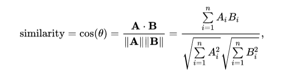

<center><h1>SCRAPEGOAT</h1></center>

<center></center>

**Scrapegoat** is a python library that can be used to scrape the websites from internet based on the relevance of the given topic irrespective of language using ***Natural Language Processing***. It can be mainly used for *non-English language* to get accurate and relevant scraped text.

## Concept
Initially the data is scraped from website  and  processed ( to remove English words if the data required is in other language). The **BERT** model is feed with processed data and topic  to compute the **cosine similarity** of the given topic with each word of the scraped data then mean of cosine similarity scores of is computed. If the mean is greater that threshold then scraped data is generated as output. Also there is a section where we are using *Adaptive threshold*.


### BERT Model
**BERT**, which stands for ***Bidirectional Encoder Representations from Transformers***, is based on Transformers, a deep learning model in which every output element is connected to every input element, and the weightings between them are dynamically calculated based upon their connection. The BERT framework was **pre-trained using text from Wikipedia**. The transformer is the part of the model that gives BERT its increased capacity for understanding context and ambiguity in language. The transformer does this by processing any given word in relation to all other words in a sentence, rather than processing them one at a time. By looking at all surrounding words, the Transformer allows the BERT model to understand the full context of the word, and therefore better understand searcher intent.


### Cosine Similarity
**Cosine similarity** is one of the metric to measure the text-similarity between two documents irrespective of their size in Natural language Processing. A word can be represented in the vector form therefore the text documents are represented in n-dimensional vector space. ***If the Cosine similarity score is 1, it means two vectors have the same orientation. The value closer to 0 indicates that the two documents have less similarity***. The Cosine similarity of two documents will range from 0 to 1.

### Multi Processing
The multiprocessing module allows the programmer to fully leverage multiple processors on a given machine. ***The basic ideology of Multi-Processing is that if you have an algorithm that can be divided into different workers (processors), then you can speed up the program.*** Machines nowadays come with 4,6,8 and 16 cores, which then can be deployed in parallel.

## Using Scrapegoat
The examples/main.py file contains these
```python
from utils import automate
from utils import SearchFunction
from multiprocess import getLinkData
from multiprocess import generateData

if __name__ == '__main__':
	s = SearchFunction('kn','engineering')
	links = s.LinkCollection(n_link=10)
	for url in links:
		text, mean = getLinkData(url=url,topic=topic, language='kn', cores=6)
		#### Save files you need by comparing mean###
	# or use below this will generate the data for you 
	#generateData(topic,folder_path,cores=6)

```

